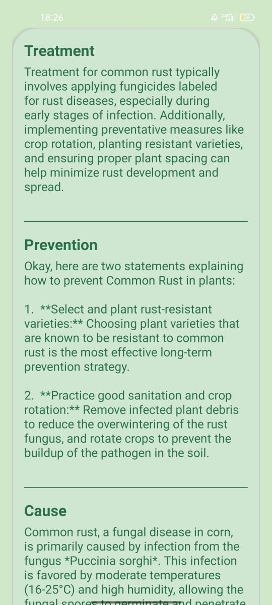

## LeafLens
**LeafLens** is a smart Android application designed to help farmers and agricultural experts detect diseases in maize (corn) leaves using their phone's camera or gallery.  
It uses a pre-trained **TensorFlow Lite model** to identify common maize diseases and provides actionable treatment advice.

Built entirely with **Kotlin**.

## some features are still in development

## Screenshots
 

 

 

 

 

 

## 📦 Setup Requirements
1. **Android Studio (latest stable version)**
2. **Physical device or emulator** (Camera functionality may not work on emulator)
3. **Gradle 8+** with Kotlin DSL support

---

## ▶ Build and Run LeafLens

1. Clone the repository.

2. Open the project in Android Studio.

3.  Add your GEMINI_API key in local.properties

4. Sync the Gradle files and run the app module.

## 🔧  Built with
- **Language:** Kotlin

- **UI Framework:**  XML + Material Design

- **Machine Learning:** TensorFlow Lite
- 
- **Navigation:** Navigation Component

## Features
  **Maize Disease Detection**
- Upload or capture a maize leaf image to analyze
- Uses a locally stored TFLite model to predict diseases such as Blight, Rust, and Leaf Spot

**Media upload**
- Upload Maize images to the application

**Treatment Suggestions**
- Get disease-specific recommendations after detection

##  Contributing
Contributions are welcome! Feel free to fork the repo, open issues, and submit pull requests

